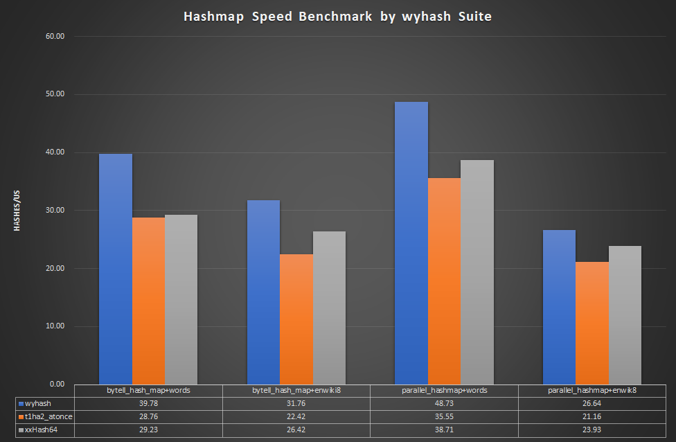
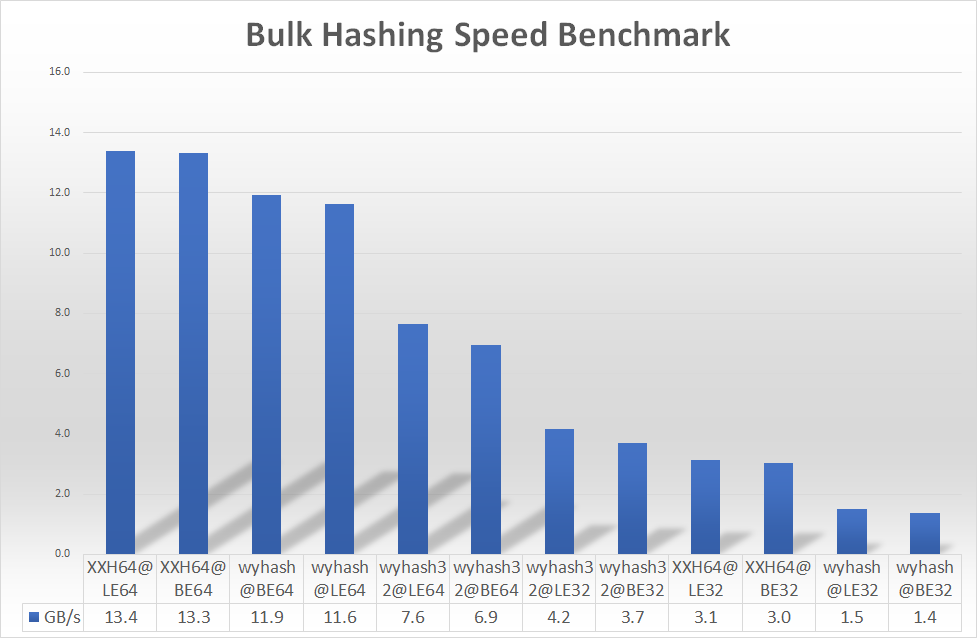
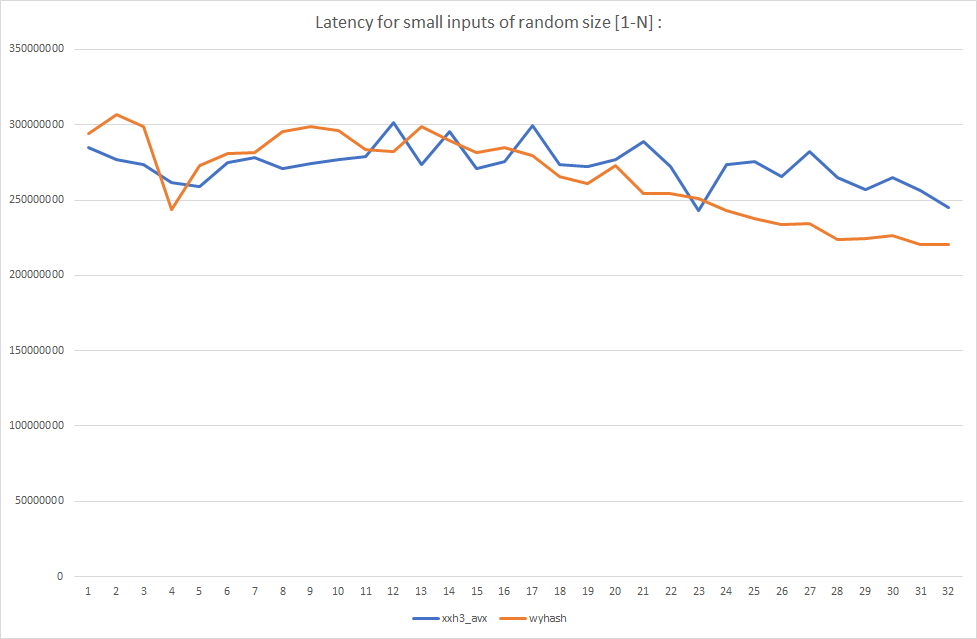
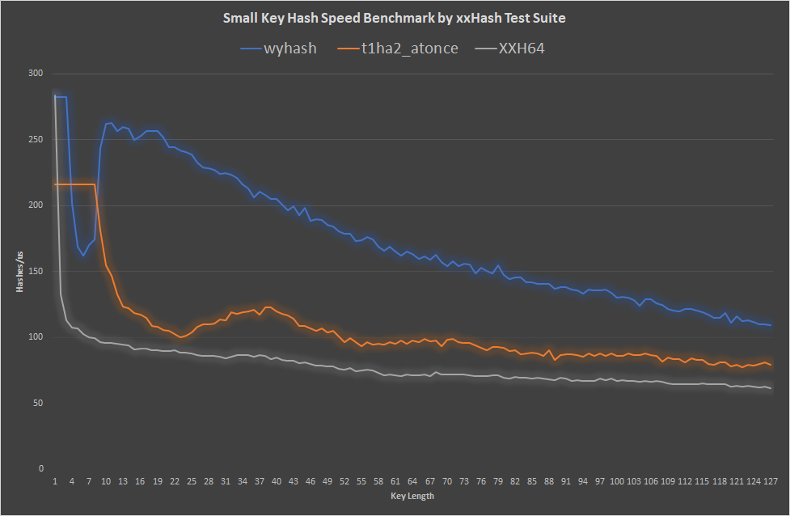
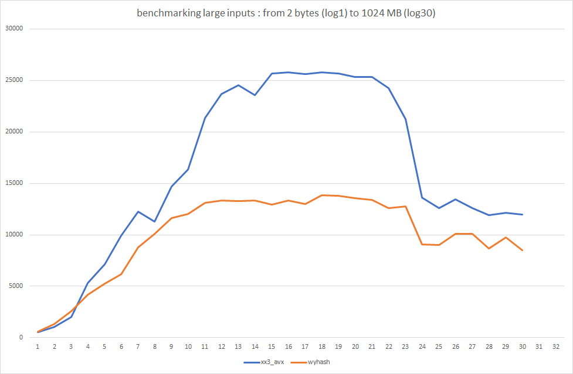
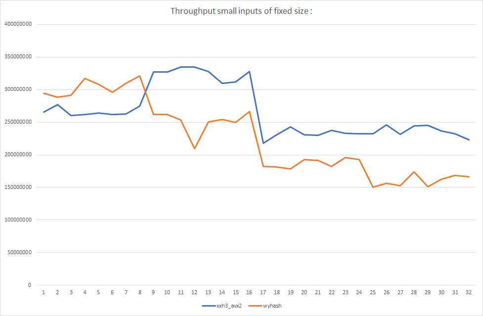

Simple Is Best
====

wyhash and wyrand are the ideal 64-bit hash function and PRNG respectively: solid, portable, fastest, simplest. wyhash passed SMHasher, wyrand passed BigCrush, practrand and designed to drop-in replace C rand(). See our [manuscript](manuscript.md). Currently wyhash is a hasher by default in a hash table in the great Zig language.

----------------------------------------


**Good Boy Only Benchmark** 

XXH3 was not included as it fails two tests according to SMHasher.

```C
#define T1HA_SYS_UNALIGNED_ACCESS 0
#define T1HA_USE_FAST_ONESHOT_READ 0
#define XXH_INLINE_ALL
#define XXH_FORCE_MEMORY_ACCESS 0
```








----------------------------------------

I thank these names:

Reini Urban

Dietrich Epp

Joshua Haberman

Tommy Ettinger

Daniel Lemire

Otmar Ertl

cocowalla

leo-yuriev

Diego Barrios Romero

paulie-g 

dumblob

Yann Collet

